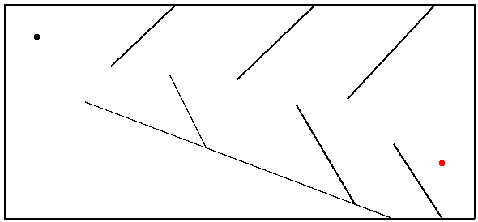

# IS698-MazeNavigationGA

This is the Assignment-4 for IS-698

by Wenbo Wang

## Demo 1



## Demo 2

Weights:
```
[-1.4762932059750438, -1.5360219059677338, -1.8873643946450502, 1.6841040583980176, -0.224473143178751, 3.499246952259229, -2.5531243808782422, 0.5711418046547563, 2.769095961977578, 1.4216955355219723, -1.63901210695781, -0.7070000670257683, 1.3033200521558803, 1.9499834458213896, 0.2165224013303929, -0.417480921724601, 2.8574775017489484]
```


## Reference

https://github.com/hardmaru/estool